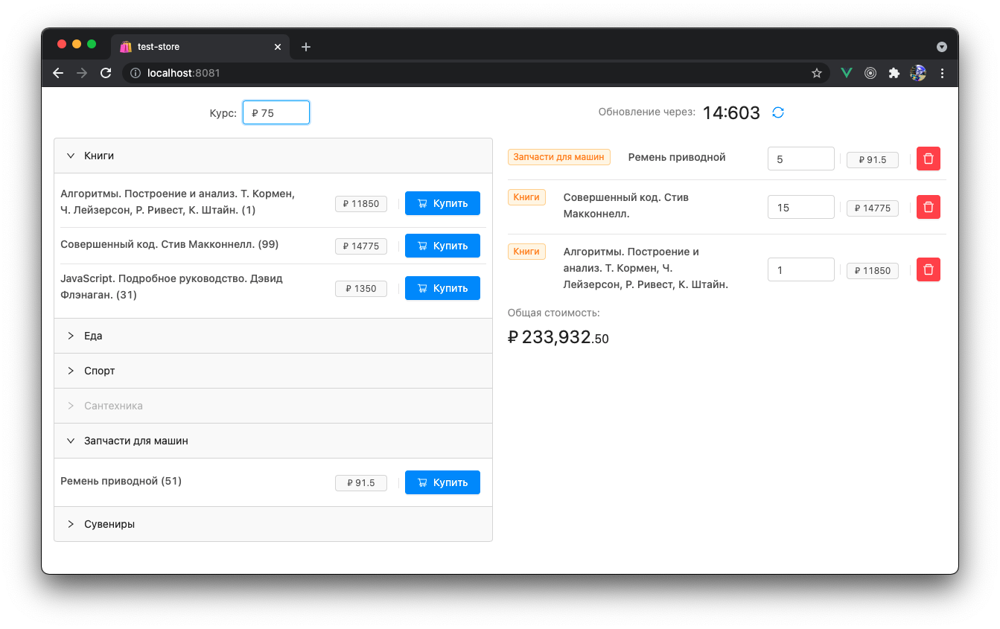

# 🛍 test-store


Тестовое задание на собеседовании.



## Условие

Получить данные из файла data.json и вывести их на страницу как это показано на рисунке.


Показанные на рисунке параметры находятся в узле Goods. "C" - цена в долларах(USD) - вывести в рублях(курс выбрать произвольно), "G" - id группы, "T" - id товара, "P" - сколько единиц товара осталось (параметр, который указан в скобках в названии).

Сопоставления id групп и товаров с их названиями находятся в файле names.json.

После вывода данных навесить обработчики для добавления выбранного товара в корзину и удаления из нее. Пример корзины показан в файле "Корзина.png". Сделать рассчет общей суммы товаров и вывести отдельным полем.
Корзина находится на одной и той же странице вместе со списком товаров.


- [x] Вывести данные используя привязку к представлению и возможностью последующего изменения (two-way binding).  Можно использовать фреймворки.

- [x] Сделать обновление цены товара в зависимости от курса валюты.

- [x] С интервалом в 15 секунд читать исходный файл data.json и одновременно менять курс доллара (вручную) на значение от 20 до 80, выполняя обновление данных в модели (с изменением в представлении). Если цена увеличилось в большую сторону - подсветить ячейку красным, если в меньшую - зеленым.

Дополнительная информация: Дизайну, показанному в примерах, следовать не обязательно. Прокомментировать основные действия.

### Запуск в режиме разработки
```console
$ npm run serve-dev
```

### Запуск в режиме прода
```console
$ npm run serve-prod
```
